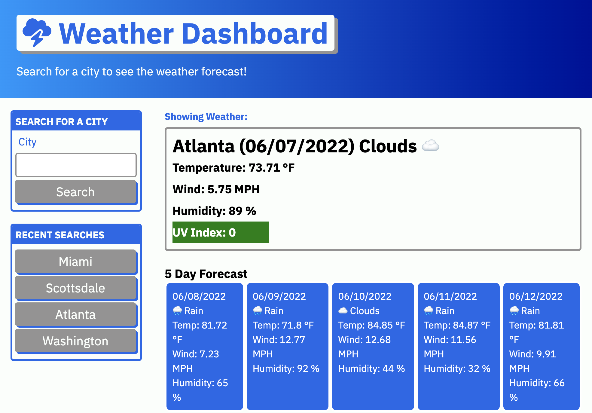

# Weather Dashboard

## Website Description
The website enables a user to search a city to display a weather forecast for the upcoming days. The user can also click a button from recent search history to repeat the search. The current weather is displayed with the five day forecast below. The UV Index is displayed in a corresponding color for severity and an icon represents the type of weather for the day. 

## Challenge Description
The weather dashboard runs in the browser and features dynamically updated HTML and CSS. It uses OpenWeather One Call API (https://openweathermap.org/api/one-call-api) to retrieve weather data for cities via their lattitude and longitude. Functions with parameters are used to display data from the API results. Arrays are used to populate the five day forecast as well as the localStorage. It uses localStorage to store persistent data, which in this case is recent search history populated to buttons. 


## User Story

```
AS A traveler
I WANT to see the weather outlook for multiple cities
SO THAT I can plan a trip accordingly
```

## Acceptance Criteria

```
GIVEN a weather dashboard with form inputs
WHEN I search for a city
THEN I am presented with current and future conditions for that city and that city is added to the search history
WHEN I view current weather conditions for that city
THEN I am presented with the city name, the date, an icon representation of weather conditions, the temperature, the humidity, the wind speed, and the UV index
WHEN I view the UV index
THEN I am presented with a color that indicates whether the conditions are favorable, moderate, or severe
WHEN I view future weather conditions for that city
THEN I am presented with a 5-day forecast that displays the date, an icon representation of weather conditions, the temperature, the wind speed, and the humidity
WHEN I click on a city in the search history
THEN I am again presented with current and future conditions for that city
```

## Tasks Completed
The HTML document includes:
* a proper title 
* proper HTML semantic labelling
* link to Font Awesome style sheet with an icon
* submit form for user input
* placeholder containers for recent search buttons and weather information
* comments

The CSS document includes:
* universal, elemental, class, and id selectors
* stylization for the header, cities button list, current weather, and five day forecasts
* universal variables
* comments

The JavaScript document includes:
* universal variables with query selectors
* api calls for current weather by city and One Api via lattitude and longitude parameters
* recent city search button creation via appending the parent div
* containers for current weather and five day forecast via appending the parent div
* event listener for clicking a city button
* saving and retrieving recent searches for button information from localStorage
* comments

## Languages
- HTML
- CSS
- JavaScript

## Links
* [Deployed webpage](https://villette0.github.io/M6C-Weather_Dashboard/)

* [Repository](https://github.com/villette0/M6C-Weather_Dashboard)

## Screenshot

